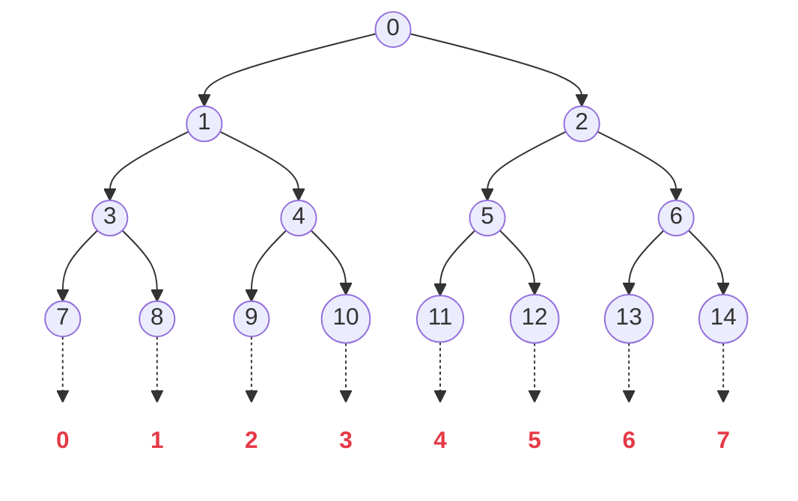
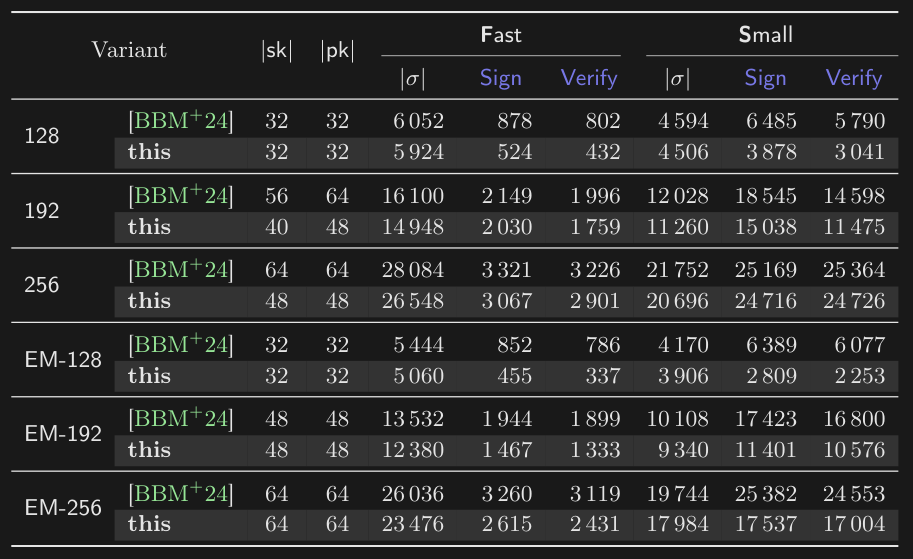

# Shorter, Tighter, FAESTer VOLEitH

## Shorter, Tighter, FAESTer: Optimizations and Improved (QROM) <br> Analysis for VOLE-in-the-Head Signatures

### authors: Carsten Baum , Ward Beullens , Lennart Braun etc.

### presenter: Tianyi Wang

### 2026-05-28

---
section: highlight
---

# 主要内容

CRYPTO2023$^{[1]}$提出VOLEitH实现基于VOLE的ZKP公开可验证，并构造了FAEST（对AES进行VOLEitH的ZKP，实现后量子签名，安全性依赖于AES的安全性）

Asiacrypt2024$^{[2]}$提出BAVC优化了数据结构，原本每个门都需要的GGM树（生成一组N-out-of-N-1 OT），该论文把全部树合成为一个大树，提升性能

本文(CRYPTO2025)$^{[3]}$对AES的进一步优化，并且目前是NIST后量子签名候选方案，具体包括：

- 把GGM树叶子节点的哈希改为AES-CTR（PRG），加快生成速度
- 设计 3-degree 检查策略，减少25%的通信量
- 实现了QROM下的安全性证明
- 原本$^{[1]}$的代码是rust写的， 本文$^{[3]}$改为c语言的 $^{[4]}$并提交给了NIST

<br>

> references: <br> \[1] Publicly Verifiable Zero-Knowledge and Post-Quantum Signatures from VOLE-in-the-Head (Authors: Carsten Baum, Lennart Braun, Cyprien Delpech de Saint Guilhem, et al.)  <br> \[2] One Tree to Rule Them All: Optimizing GGM Trees and OWFs for Post-Quantum Signatures (Authors: Carsten Baum, Ward Beullens, Shibam Mukherjee, et al.) <br> \[3] Shorter, Tighter, FAESTer: Optimizations and Improved (QROM) Analysis for VOLE-in-the-Head Signatures (Authors: Carsten Baum, Ward Beullens, Lennart Braun, et al.) <br> \[4] https://github.com/faest-sign/faest-ref

---

# 后量子签名方案对比

安全级别：128-bit

| 算法类别 | 具体方案 | 签名速度 | 验证速度 | 签名大小 | 安全性基础 |
| :--- | :--- | :--- | :--- | :--- | :--- |
| 基于编码 | SDitH / CROSS | 毫秒级 | 毫秒级 | $\color{red}{\text{7 kB - 9 kB}}$ | 伴随式解码难题 |
| 基于格 (Lattice) | Dilithium <br>(现 ML-DSA) | $\color{green}{\text{数十微秒级 }}$ | $\color{green}{\text{数十微秒级 }}$ | $\color{green}{\text{2.4 kB}}$ | 格困难问题 (如 LWE, SIS) |
| 早期 MPCitH | Picnic / Banquet | $\color{red}{\text{数十毫秒级 }}$ | $\color{red}{\text{数十毫秒级 }}$ | $\color{red}{\text{12 kB - 30+ kB}}$ | 纯对称密码 (哈希) |
| 哈希签名 | SPHINCS+ <br>(现 SLH-DSA) | $\color{red}{\text{数十至上百毫秒级}}$ | $\color{green}{\text{亚毫秒级 (< 1 ms)}}$ | $\color{red}{\text{7.8 kB - 17 kB}}$ | 纯对称密码 (哈希) |
| 本文方案 (VOLEitH) | Optimized<br> FAEST$^{[1]}$ | 0.46 ms - 3.88 ms | 0.34 ms - 3.04 ms | 3.9 kB - 5.9 kB | 纯对称密码<br> (AES, SHAKE) |

> references: \[1]\[CRYPTO2025] Shorter, Tighter, FAESTer: Optimizations and Improved (QROM) Analysis for VOLE-in-the-Head Signatures

---
section: Preliminary
layout: two-cols
---

# VOLE

VOLE 是 OT（Oblivious Transfer）的一个线性版本

* 发送方（Sender）持有：向量 <span class="text-emerald-600 dark:text-emerald-400">$a$</span> 和 向量 <span class="text-emerald-600 dark:text-emerald-400">$b$</span>
* 接收方（Receiver）持有：向量 <span class="text-amber-600 dark:text-amber-400">$x$</span>

Sender 持有 <span class="text-emerald-600 dark:text-emerald-400">$a,b$</span> ， Receiver 持有 <span class="text-amber-600 dark:text-amber-400">$x,y$</span>，满足：$y = a\cdot x + b$

其中 Sender 为<span class="text-emerald-600 dark:text-emerald-400">证明者（Prover）</span>，且不知道 $x,y$；<br>
Receiver 为<span class="text-amber-600 dark:text-amber-400">验证者（Verifier）</span>且不知道 $a,b$ 

<v-click>

Prover 有 witness <span class="text-emerald-600 dark:text-emerald-400">$w$</span>，<br>
P 发送 <span class="text-emerald-600 dark:text-emerald-400">$\widetilde{w}=w-a$</span>，同时 V 更新 <span class="text-amber-600 dark:text-amber-400">$\widetilde{y}=y+\widetilde{w}\cdot x$</span><br>
此时依旧满足 $\widetilde{y} = w\cdot x + b$

加法门：直接线性运算（免费）<br>
对于 $w_3=w_1+w_2$，有 $y_1+y_2=(w_1+w_2)\cdot x+(b_1+b_2)$

乘法门：相对复杂但验证方式更多，例如最广泛使用的 QuickSilver<br>
对于 $w_3=w_1\cdot w_2$ —— 

</v-click>

::right::

# QuickSilver

<v-click>

首先引入一组 $\widetilde{y}_r = a_r \cdot x + b_r$（用于盲化），则：<br>
Prover 拥有： <span class="text-emerald-600 dark:text-emerald-400">$w_1, w_2, w_3, a_r$ 和 $b_1, b_2, b_3, b_r$</span><br>
Verifier 拥有： <span class="text-amber-600 dark:text-amber-400">$x$ 和 $y_1, y_2, y_3, y_r$</span>，其中 $y_i = w_i \cdot x + b_i$

P 计算 <span class="text-emerald-600 dark:text-emerald-400">$A = w_1 \cdot b_2 + w_2 \cdot b_1 - b_3,\; B = b_1 \cdot b_2$</span><br>
P 计算 <span class="text-emerald-600 dark:text-emerald-400">$U = A + a_r,\; V = B + b_r$</span>（盲化）<br>
并发送**盲化**后的 <span class="text-emerald-600 dark:text-emerald-400">$U$</span> 和 <span class="text-emerald-600 dark:text-emerald-400">$V$</span> 给 V<br>
V 校验：<span class="text-amber-600 dark:text-amber-400">$y_1 \cdot y_2 - y_3 \cdot x + y_r$</span> $\stackrel{?}{=}$ <span class="text-emerald-600 dark:text-emerald-400">$U$</span> $\cdot$ <span class="text-amber-600 dark:text-amber-400">$x$</span> + <span class="text-emerald-600 dark:text-emerald-400">$V$</span>

</v-click>
<v-click>
    
多个电路的**批量验证**，V 发给 P 随机挑战 <span class="text-amber-600 dark:text-amber-400">$c$</span><br>
P 计算：
<span class="text-emerald-600 dark:text-emerald-400">$A_{sum} = \sum_{i=1}^N c^i \cdot (w_{1,i} \cdot b_{2,i} + w_{2,i} \cdot b_{1,i} - b_{3,i})$</span><br>
<span class="text-emerald-600 dark:text-emerald-400"> $\quad\quad\quad\ B_{sum} = \sum_{i=1}^N c^i \cdot (b_{1,i} \cdot b_{2,i})$</span><br>
P 仅发给 V 两个值 <span class="text-emerald-600 dark:text-emerald-400">$U = A_{sum} + a_r,\; V = B_{sum} + b_r$</span><br>
V 验证：$\sum_{i=1}^N \left[ c^i \cdot (y_{1,i} \cdot y_{2,i} - y_{3,i} \cdot x) \right] + y_r \stackrel{?}{=} U \cdot x + V$

</v-click>
<v-click>

<div class="bg-gray-100 dark:bg-gray-800 p-3 rounded-md mt-5 border-l-4 border-blue-500 shadow-sm">
① 最初状态是 P 持有 a,b 且 V 持有 x,y 满足 y = a* x + b <br>
② VOLE 能完成零知识证明
</div>
</v-click>
<v-click>


</v-click>

---
layout: two-cols
---
# GGM Tree

目标：构造 N-1-out-of-N OT（用于打开 N 个数值里的 N-1 个，由 Verifier 选择）

用于打开N个数值里面的 $N-1$个数值（OT协议）

原有方案：证明者对 N 个数字进行承诺，然后公开 $N-1$ 个数字

假设 $N$ 个数字分别为 $\{a_i\}_{i\in N}$

1. 对每个数字进行哈希，然后计算一起的哈希
2. 验证者选择第 $p$ 个数字
3. 证明者公开其他 $N-1$ 个节点的信息和 第 $p$ 个数字的哈希<br>
即  $\{a_i\}_{i\in N\land i\neq p}$ 和 $H(a_p)$
4. 验证者计算 $N-1$ 个节点的哈希，最终检查承诺

共需发送 N 个数据

利用GGM树，把通讯开销降低到 log(N)

::right::

<br><br><br><br>
若验证者选择节点 $p$，Prover只需发送根节点到 $p$ 路径上的<br>
全部**邻居**节点和 $H(a_p)$ 即可
```
           ROOT
         /      \ （父节点通过PRG逐层生成子节点）
        r1       r2
       /  \     /   \
     r3    r4  r5    r6
     ↓    ↓  ↓    ↓
   H(r3) H(r4) H(r5) H(r6)
           ↓↓↓ （可以直接把全部哈希结果拼接然后再进行一次哈希）
            com
```

假设需要隐藏的数字是 $r4$，则Prover向Verfier发送 $r2\ r3\ H(r4)$<br>
Verifier可以恢复 $com$ 的但不知道 $r4$ 的信息

---

# VOLEitH

有了 (N-1)-out-of-N OT，如何构建VOLE初始关系 ${\color{goldenrod}{y}} =\green{a}\cdot {\color{goldenrod}{x}}+\green{b}$ ？

定义每个叶子为 $t_i$，选择的叶子（N-1不包括的那个）为 $t_\Delta$

P 计算 $a=\sum t_i, b=-\sum t_i\cdot i$<br>
V 计算 $y=\sum_{i\neq\Delta}t_i\cdot(\Delta-i)$<br>
易得到若 P 和 V 诚实，则 ${\color{goldenrod}{y}} =\green{a}\cdot {\color{goldenrod}{\Delta}}+\green{b}$ 成立

此时 $\Delta$ 可以是任意值，故 $\Delta$ 由 P 生成承诺的哈希值决定<br>
$\rightarrow$ P 无法在计算 $a,b$ 之前得到 $\Delta$ <br>
$\rightarrow$ 保证 P 不会造假

---
layout: two-cols
---

 #  VOLEitH + AES $\rightarrow$ FAEST

### 备料

$\mu \leftarrow H_2^0(pk||msg), (r, iv^{pre}) \leftarrow H_3(sk||\mu||\rho)$<br>
待签名消息 $msg$ ，公钥 $pk$，随机数 $\rho\leftarrow \{0,1\}^\lambda$<br>
核心作用：绑定，保证签名不会被转移到其他消息<br>
$r$ 和 $iv^{pre}$ 用于生成 GGM 树的树根

### 造树

生成 GGM 树。计算 全部叶节点哈希值的集体哈希承诺 $com$，
<br>全量去承诺结构 $decom$，校准向量组 $c_1, \dots, c_{\tau-1}$<br>
$(com, decom, c_i, u, V)\leftarrow\text{VOLECommit}(r, iv, \dots)$

计算 $chall_1\leftarrow H_2^1(\mu||com||c_1||...||c_{\tau-1}||iv^{pre})$

### 准备 ZKP

 $\text{VOLEHash}$ 是一个线性同态的哈希函数，计算 <br>
 $\tilde{u} \leftarrow \text{VOLEHash}(chall_1, u), \tilde{V} \leftarrow \text{VOLEHash}(chall_1, V)$

::right::

<br>

对于 $Q = V + u \cdot \Delta$，在验证阶段 验证者计算<br> $\tilde{Q} \leftarrow \text{VOLEHash}(chall_1, Q)$，则有 $\tilde{Q} = \tilde{V} + \tilde{u} \cdot \Delta$

$w$：AES 电路每个乘法门的 witness（也就是 S-box 的电路）<br>
利用私有向量 $u$ 的前 $l$ 位对 $w$ 进行一次性密码本式掩码隐藏，得到<br>
计算见证承诺 $d=w\oplus u_{[0...l)}$（即乘法门的见证和掩码的偏差）<br>
计算 $chall_2\leftarrow H_2^2(chall_1||\tilde{u}||\tilde{V}||d)$<br>
用 $w$ 、$\tilde{u}$ 和 $\tilde{V}$ 生成 QuickSilver 协议的证明系数 $(\tilde{a}_0, \tilde{a}_1, \tilde{a}_2)$

### 抽卡并打包

初始化 $ctr \leftarrow 0$ 计算 $chall_3 \leftarrow H_2^3(chall_2 || \tilde{a}_0 || \tilde{a}_1 || \tilde{a}_2 || ctr)$<br>
刚好够重构 GGM 树的部分 $decom_I \leftarrow \text{BAVC.Open}(decom, I)$<br>
包括隐藏节点路径上的兄弟节点和隐藏节点的哈希<br>
要求 $chall_3$ 的最后 $w_{grind}$ 个比特全为 0 并且 $decom_I$ 不超过阈值<br>
则 $ctr \leftarrow ctr + 1$ 并重新计算 $chall_3$ 直到满足条件 

输出 $\sigma := ((c_i)_{i=1..\tau-1}, \tilde{u}, d, \tilde{a}_1, \tilde{a}_2, decom_I, chall_3, iv^{pre}, ctr)$

验证阶段：验证者输入签名 $\sigma$，把上面步骤重走一遍，重构 GGM 树并重新计算 $\text{VOLEHash}$，把 $Q$ 代入 QuickSilver 校验多项式，并且算出来的最终常量等于证明者发过来的 $\tilde{a}_0$，则签名合法。

---
section: BAVC[Asiacrypt24]
layout: two-cols
---

# 单颗GGM

核心用单一大树替代很多小树

旧方案：生成 $\tau$ 棵独立的树，每棵树有 $N$ 个叶子，<br>为了隐藏每棵树的一个叶子，需要披露 $\tau\cdot\log N$ 个节点

新方案：从一个主种子出发，<br>生成一颗有 $L=\tau\cdot N$ 个叶子的大完全二叉树

如果直接拼接<br>即前 $N$ 个叶子给向量 $1$，第 $N+1$ 到 $2N$ 个给向量 $2$......<br>此时 $\tau$ 个需要被隐藏的叶子将会十分**分散**

将向量的索引**交错映射**到树的叶子上：<br>树的第 0 个叶子对应第 1 个向量的第 0 个位置；<br>树的第 1 个叶子对应第 2 个向量的第 0 个位置......<br>当隐藏的节点聚集在一起时，<br>它们的路径会在树的较低层级（靠近叶子）就发生合并。

::right::

# 叶子交错

假设我们要生成 **2 个向量**，每个向量长 **4**。共需 2×4=8 个叶子。<br> 大树共有 8 个叶子，编号 0 到 7。




---
layout: two-cols
---

# 叶子交错

假设验证者要求：<br>第 1 个向量隐藏 0 号位置；第 2 个向量隐藏 0 号位置。

原始方案：不交错 -> 前 4 个给向量 1，后 4 个给向量 2。

需隐藏的叶子：<br>
向量 1 的 0 号 -> 叶子 0（节点$r_7$）；<br>
向量 2 的 0 号 -> 叶子 4（节点$r_{11}$）。

需要披露节点 $r_8,r_4,r_{12},r_6$（以及$r_7$和$r_{11}$的哈希）

```
                         r0
                     /         \
               r1                  r2            
            /      \            /      \         
           r3       r4         r5       r6       
          /  \     /   \      /  \     /   \     
        r7    r8  r9   r10  r11   r12 r13   r14   
         0    1    2    3    4    5    6    7
```

::right::

<br><br><br><br>
BAVC方案：叶子交错（Interleaving）-> 将叶子按“轮次”穿插分配<br>
叶子 0 -> 向量 1 的第 0 位；叶子 1 -> 向量 2 的第 0 位<br>
叶子 2 -> 向量 1 的第 1 位；叶子 3 -> 向量 2 的第 1 位...以此类推

需隐藏的叶子：
向量 1 的 0 号 → 叶子 0（节点$r_7$）
向量 2 的 0 号 → 叶子 1（节点$r_8$）

需要披露节点$r_4,r_2$（以及$r_7$和$r_8$的哈希），大幅减小通信开销

在实际中，挑战是随机的，不一定总是“隐藏 V1 的 0 和 V2 的 0”。可能是“V1 隐藏 0，V2 隐藏 3”。

Grinding：每次签名都会改变计数器的值，哈希生成的挑战也会变。签名者会不断尝试，直到算出来的挑战是类似“V1 隐藏 0，V2 隐藏 0”或者“V1 隐藏 2，V2 隐藏 2”这种**索引相近**的情况。

总结：“叶子交错”让不同向量中相同索引的位置，在物理大GGM树上成为“邻居”，从而只需剪掉树的小树枝，而不是把树剪得支离破碎。

> 碎碎念：宏观上，对于第 $i$ 个向量需要隐藏的位置 $a_i$ （原GGM树内的位置），$max\{a_i\}-min\{a_i\}$ 的大小决定了最终的通讯开销

---

# 阈值截断与 Grinding

阈值过高 -> 很快成功，但点过于分散（签名变长甚至退化为多GGM树）<br>
阈值过低 -> 签名极小，但需要计算多次哈希

实际实现中：
- FAEST-128s（追求极小尺寸，慢速） $T_{open}=102$，签名时间为3.2ms，签名尺寸为4594Byte
- FAEST-128f（追求速度，尺寸稍大） $T_{open}=110$，签名时间为0.43ms，签名尺寸为6052Byte

其中 $T_{open}$ 为代表 GGM 树允许披露的最大节点总数。
如果超过了 $T_{open}$，则Grinding（重新计算），然后再检测有无超过阈值

---

# BAVC的具体流程

第一阶段：承诺
1. 生成树：从一个主种子 $root$ 开始，用 PRG 生成有 $L$ 个叶子节点的完全二叉树
2. 叶子映射：如前面所描述的，$leaf_0 \rightarrow$ 向量 1 的第 0 位，$leaf_1 \rightarrow$ 向量 2 的第 0 位...
3. 计算叶子承诺 $com$（计算每个叶子的哈希然后生成最终的承诺，后续有使用PRG优化的方案）

第二阶段：剪枝
1. 标记不能发送的节点（需要隐藏的节点的父亲节点和祖宗节点）
2. 计算最小需要发送哪些节点（全部不能发送的节点的邻居节点）
3. 阈值计算：计算需要发送的节点数，如果$>T_{open}$则说明太分散，需要重新生成挑战（Grinding）；若$\leq T_{open}$ 则 输出这些内容（包括隐藏节点的哈希值一起）

第三阶段：重建
1. 验证者可以根据挑战，知道哪些部分是空白，然后利用证明者发送的节点，来重构整棵树
2. 检验所有种子的哈希是否等于全局承诺 $com$

---
section: FAESTer
layout: two-cols
---

# 用 AES-CTR PRG 替代 Hash

AES 有硬件指令集加速（AES-NI），比哈希计算还快

问题：PRG 不具备哈希函数的抗碰撞性<br>
$\rightarrow$ 引入 Universal Hash / Almost-Injective PRG

```
           ROOT
         /      \ （父节点通过PRG逐层生成子节点，
        r1       r2                   和之前一样）
       /  \     /   \
     r3    r4  r5    r6
     ↓    ↓  ↓    ↓
   H(r3) H(r4) H(r5) H(r6) <- 这一步原本用的是哈希
           ↓↓↓             把它改为 AES-CTR PRG
            com
```
::right::

# 设计原理与组件

* 基础 PRG：基于 AES-CTR 模式，即 $PRG(sd, iv, twk) = \text{AES}_{sd}(iv + twk)$。
* 抗碰撞性：AES 在 Key 固定时是置换，但在 GGM 树中 $sd$ 作为 Key 使用。虽然统计上可能存在碰撞，但计算上寻找 Key 的碰撞等同于攻破 AES，因此是安全的。
* 安全性增强：标准模式引入 Universal Hash 将计算绑定提升至统计绑定；EM 模式则直接依赖于 Almost-Injective PRG 的特性。
* 域分离： 通过 `twk` (Tweak) 作用于 IV，确保 GGM 树中不同层级和位置的节点生成独立的随机流，避免频繁更换 AES Key 带来的硬件开销。
---
layout: two-cols
---

# 标准模式

私钥是 AES 密钥 k，证明的陈述是 $AES_k(x) = y$<br>
因 AES 包含密钥扩展，故 ZKP 中需把密钥扩展的 S 盒证明

给定一个叶子 $(i,j)$，叶节点数值为 $k_{i,j}$，$\mathrm{iv}$ 为公共输入，<br>
$\mathrm{tweak}_i$ 为轮内微调值，$a_i$ 为行内 Universal Hash 系数

1. 用 PRG 扩展得到 $4\lambda$ 长度的串：<br>
$X_{i,j} = \mathrm{PRG}(k_{i,j};\mathrm{iv},\mathrm{tweak}_i) \in \{0,1\}^{4\lambda}.$<br>
2. 将 $X_{i,j}$ 切分为两段并计算叶子承诺$c_{i,j}$：<br>
$X_{i,j} = (x^{(0)}_{i,j},x^{(1)}_{i,j}),\quad c_{i,j} = a_i \cdot x^{(0)}_{i,j} + x^{(1)}_{i,j}.$<br>
3. 保留种子分量：$sd_{i,j} = x^{(0)}_{i,j}.$<br>
4. 计算哈希<br>
对固定 $i$ 的所有叶子承诺做行内聚合：<br>
$h_i = H_1\big(c_{i,0} \| c_{i,1} \| \cdots \| c_{i,N_i-1}\big).$<br>
对所有行聚合值做一次总哈希：<br>
$h = H_1\big(h_0 \| h_1 \| \cdots \| h_{\tau-1}\big).$<br>

::right::

# EM 模式

为了减小签名，使用 Even-Mansour 结构<br>
把 AES 密钥当作公开常数 $x$，私钥变成了明文 $k$<br>
证明的陈述是 $AES_x(k) \oplus k = y$

由于 AES 密钥是公开的，故无须证明密钥扩展过程
同时 PRG 承诺也可以直接更激进。

EM 模式的叶子承诺路径更短，不使用 Universal Hash 压缩。

1. 直接保留叶子密钥作为种子：$sd^{\mathrm{EM}}_{i,j} = k_{i,j}.$<br>
2. 用 PRG 输出叶子承诺：$c^{\mathrm{EM}}_{i,j} = \mathrm{PRG}_{2\lambda}(k_{i,j};\mathrm{iv},\mathrm{tweak}_i)$<br>
即 EM 中叶子承诺可视为直接由 PRG 给出（无 Universal Hash ）<br>
3. 最终承诺聚合<br>
EM 模式同样通过两层 $H_1$ 聚合得到最终承诺：<br>
$h^{\mathrm{EM}}_i = H_1\big(c^{\mathrm{EM}}_{i,0} \| \cdots \| c^{\mathrm{EM}}_{i,N_i-1}\big),$ 
$h^{\mathrm{EM}} = H_1\big(h^{\mathrm{EM}}_0 \| \cdots \| h^{\mathrm{EM}}_{\tau-1}\big).$

---
section: Shorter
---

# 理论基础

为什么能压缩？
- 基础事实：AES 的 S-box 核心操作是在 $GF(2^8)$ 上求逆 $y=x^{-1}$，每个门需要提交 8-bit 的 witness
- 二次扩域：$GF(2^8)$ 是 $GF(2^4)$ 的二次扩域
- 范数映射：定义映射 $N(a)=a^{17}$，其中 $N(a)\in GF(2^4), a\in GF(2^8)$
- 平方免费：
    -  $GF(2^{任意正整数})$ 的特征都是 2，存在 1+1=0 （加法就是异或）
    -  $2ab \equiv ab + ab$，自己异或自己始终得 0
    -  $(a + b)^2 = a^2 + 2ab + b^2 = a^2 + b^2$
    -  结论：若特征为 2 ，则平方表现出线性 $f(a+b)=f(a)+f(b)$

S-box之后，还有一个仿射变换，即在$GF(2)$上做矩阵乘法（线性运算）和异或。<br>伽罗瓦理论里的迹映射表明把 $GF(2^8)$ 拆成 $GF(2)$ 做操作也是线性的<br>$\rightarrow$ AES 中我们只需关心 S-box 这一个 $GF(2^8)$ 上求逆的乘法门运算，其他的全部是加法门


---

# 压缩

核心问题：S-box需要执行 $y=x^{-1}$ 这一 $\mathbb{F}_{2^8}$ 上的运算，每个 S 盒都要这个 8bit 的证明。<br>
$\rightarrow$ Prover 必须把每一轮 S-box 的输出作为 Witness 发送给 Verifier

待压缩数据为 $a=x$
压缩（$\mathbb{F}_{2^8}\rightarrow\mathbb{F}_{2^4}$ ）：用范数 $N(a)=a^{17}, N(a)\in\mathbb{F}_{2^4}$ <br>
提交（发送给验证者）：发送 $c=(N(a))^{-1}=a^{-17}$（而不是提交 $y$）<br>
恢复（$\mathbb{F}_{2^4}\rightarrow\mathbb{F}_{2^8}$ ）：$y = a^{-1} = c \cdot a^{16}$

偶数轮：<br>
证明者不需要提交完整的逆 $a^{-1}$，而是提交范数的逆 $c=(N(a))^{-1}=a^{-17}$<br>
原本需验证的关系为 $c\cdot a^{17}=1$，同乘 $a$ 得到 $c\cdot a^2\cdot a^{16}=a$（避免除零错误）<br>
从 $a\rightarrow a^2$ 和 $a\rightarrow a^{16}$ 都是线性（平方）操作，无须额外通讯<br>
接着利用 $y=a^{-1}=a^{-17}\cdot a^{16}=c\cdot a^{16}$，恢复 $y\in\mathbb{F}_{2^8}$，即这一轮输出 也是下一轮输入

奇数轮：<br>
Prover 仍然提交完整的 8-bit S-box 输出 $y=x^{-1}$；为支持 0 输入，检查 $x^2y=x\land xy^2=y$

---
layout: two-cols
---

# 为什么这样压缩

- Prover  新提交（承诺） 的变量，它的阶数就是 **1**
- 线性操作（加法、常量乘法、有限域上的平方），阶数不增加
- 两个变量相乘，阶数相加
- 验证 Degree-2 和 Degree-3 的等式是可以接受的，但更多阶数不行

如果连续压缩：<br>
第零轮 ——<br>输入 $x_1$（一阶），Prover 提交 4-bit 的 $c_1$（一阶），约束方程<br>$c_1 \cdot x_1^2 \cdot x_1^{16} = x_1$（三阶），恢复输出 $y_1 = c_1 \cdot x_1^{16}$（二阶）<br>
第一轮 ——<br>输入 $x_2=y_1$ （二阶），Prover 提交 4-bit 的 $c_2$（一阶），约束方<br>程 $c_2 \cdot x_2^2 \cdot x_2^{16} = x_2$（五阶），恢复输出 $y_2 = c_2 \cdot x_2^{16}$（三阶）<br>
第二轮 ——<br>输入 $x_3=y_2$ （三阶），Prover 提交 4-bit 的 $c_3$（一阶），约束方<br>程 $c_3 \cdot x_3^2 \cdot x_3^{16}=x_3$（七阶），恢复输出 $y_3 = c_3 \cdot x_3^{16}$（四阶）

::right::

#
<br>

如果不连续压缩，而是奇偶轮分开：<br>
第零轮（偶数轮）——<br>输入 $x_1$（一阶），Prover 提交 4-bit 的 $c_1$（一阶），约束方程 $c_1 \cdot x_1^2 \cdot x_1^{16} = x_1$（三阶），恢复输出 $y_1 = c_1 \cdot x_1^{16}$（二阶）<br>
第一轮（奇数轮）——<br>输入 $x_2=y_1$ （二阶），Prover 提交 8-bit 的 $y_2$（一阶），约束方程 $x_2^2\cdot y_2=x_2$（三阶），无须恢复<br>
第二轮（偶数轮）——<br>输入 $x_3=y_2$ （一阶），和第一轮次数相同

<br>

误区：为什么对于 $x$ 是一阶，而 $c=x^{-17}$ 也是一阶？

因为在 ZKP 中，阶数是由谁来算决定的，而不是由数学公式决定<br>
证明者发送给验证者的数据全部都是一阶，只有验证者对证明者给的数据进行乘法运算才会提升阶数

---
section: summary
---

# 性能效率



---
layout: two-cols
---

# 他们分别做了什么工作

\[1\]（美密23）把VOLE结合MCPitH改为了VOLEitH，<br>可以让公开可验证，并构建了基于AES的后量子签名FAEST

\[2\]（亚密24）引入“叶子交错”技术，使签名体积减小

\[3\]（美密25）用AES-CTR(PRG)替代哈希，提升性能；<br>利用数论关系压缩签名体积；给出QROM下的安全证明

> references: <br> \[1] Publicly Verifiable Zero-Knowledge and Post-Quantum Signatures from VOLE-in-the-Head (Authors: Carsten Baum, Lennart Braun, Cyprien Delpech de Saint Guilhem, et al.)  <br> \[2] One Tree to Rule Them All: Optimizing GGM Trees and OWFs for Post-Quantum Signatures (Authors: Carsten Baum, Ward Beullens, Shibam Mukherjee, et al.) <br> \[3] Shorter, Tighter, FAESTer: Optimizations and Improved (QROM) Analysis for VOLE-in-the-Head Signatures (Authors: Carsten Baum, Ward Beullens, Lennart Braun, et al.)

::right::

# my idea

国密

- AES -> SM4 （1:3结构）
- SHA-3 -> SM3（输出长度可变）
