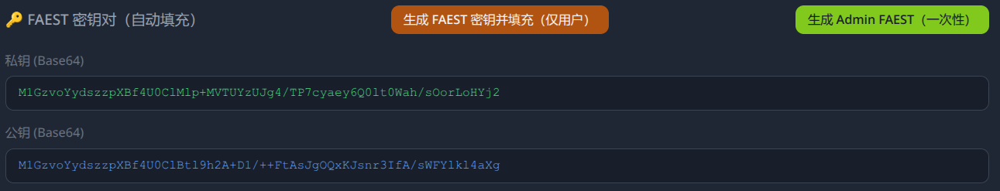
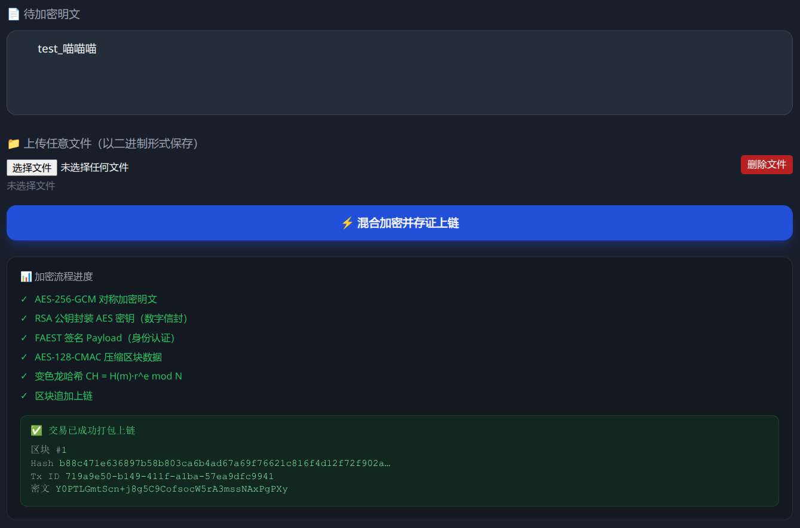
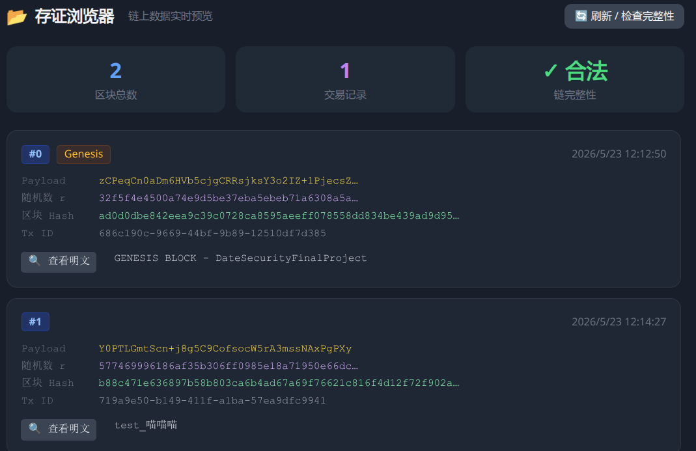
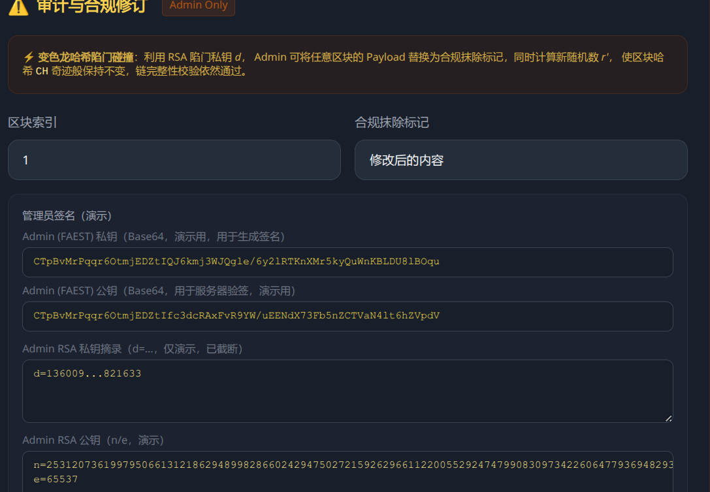
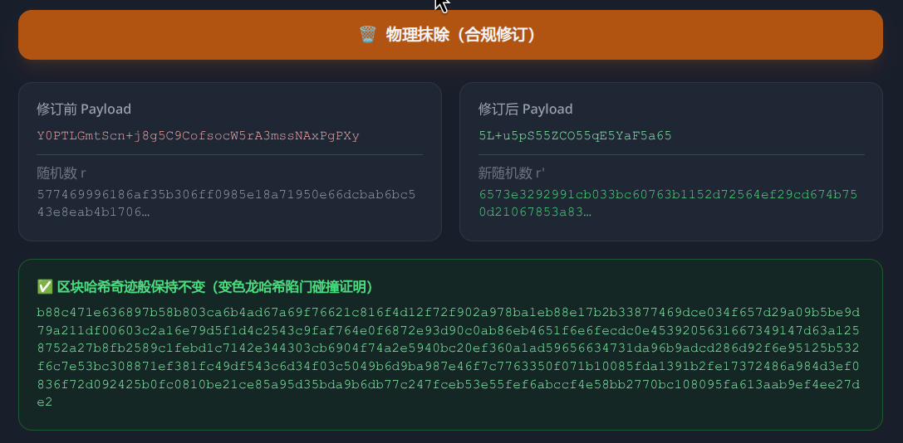
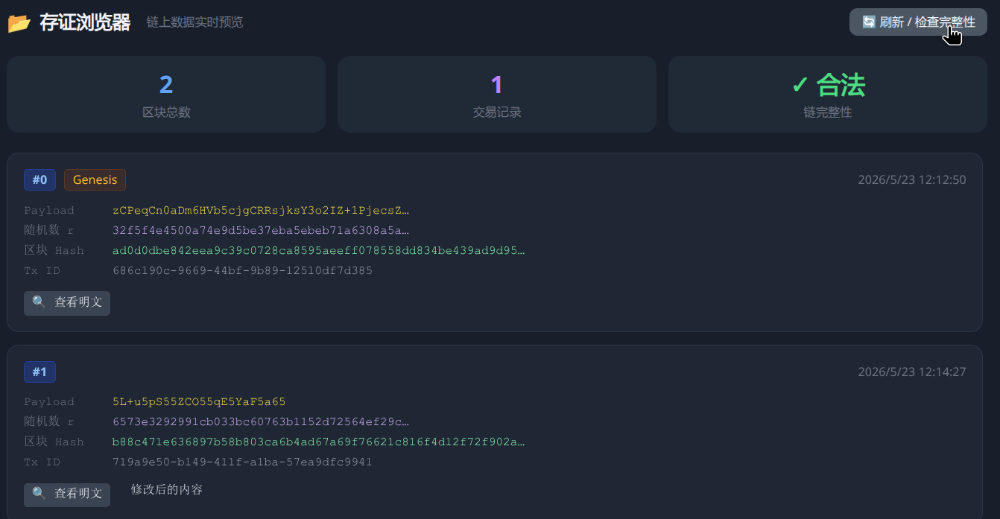

# 基于 RSA 和 AES 的加密系统

## 数据安全实训大作业
 

### 演讲人: 王添翼

### 2026-05-26

---
section: 系统概述
---

# 系统概述

- 使用基于 RSA 数学困难问题$^{[1]}$ 构建的可修订区块链$^{[2,3]}$
- 使用 FAEST 签名算法$^{[4]}$ 对数据进行签名，其中 FAEST 即为对 AES 进行基于 向量不经意线性求值（Vector Oblivious Linear Evaluation, VOLE）的零知识证明
- 密钥派发部分必须使用 RSA 加密算法，但 RSA 依托于大数分解数学困难问题，导致不具备量子抗性，故可选：
    - 不使用密钥派发，线下分发密钥，能够抗量子
    - 使用 RSA 进行密钥派发，但量子计算机的敌手能够获取密钥，FAEST 保证完整性
- 用 AES 替代普通哈希，在具有 AES-IN 的设备上提升性能

 
references: 
[1] D Grigoriev  et al., RSA and redactable blockchains, HAL open science, 2020. 
[2] G. Ateniese et al., Redactable Blockchain - or - Rewriting History in Bitcoin and Friends, IEEE EuroS&P, 2017. 
[3] M Jia et al., Redactable Blockchain From Decentralized Chameleon Hash Functions, IEEE Transactions on Computers, 2022. 
[4] C. Baum et al., Shorter, Tighter, FAESTer: Optimizations and Improved (QROM) Analysis for VOLE-in-the-Head Signatures, CRYPTO, 2025.

---
section: 基础知识
---

# FAEST

FAEST 是基于 VOLE-in-the-head 的零知识证明，即将 AES 的电路在 $GF(2^8)$ 转化为签名 
证明知道 AES 明文但不泄露明文的任何信息 $\rightarrow$ 用 AES 的明文作为密钥对消息进行签名 
下图是各方案在安全级别 128-bit 的对比

| 算法类别 | 具体方案 | 签名速度 | 验证速度 | 签名大小 | 安全性基础 |
| :--- | :--- | :--- | :--- | :--- | :--- |
| 基于编码 | SDitH / CROSS | 毫秒级 | 毫秒级 | $\color{red}{\text{7 kB - 9 kB}}$ | 伴随式解码难题 |
| 基于格 (Lattice) | Dilithium | $\color{green}{\text{数十微秒级 }}$ | $\color{green}{\text{数十微秒级 }}$ | $\color{green}{\text{2.4 kB}}$ | 格困难问题 (如 LWE, SIS) |
| 早期 MPCitH | Picnic / Banquet | $\color{red}{\text{数十毫秒级 }}$ | $\color{red}{\text{数十毫秒级 }}$ | $\color{red}{\text{12 kB - 30+ kB}}$ | 纯对称密码 (哈希) |
| 哈希签名 | SPHINCS+  | $\color{red}{\text{数十至上百毫秒级}}$ | $\color{green}{\text{亚毫秒级 (< 1 ms)}}$ | $\color{red}{\text{7.8 kB - 17 kB}}$ | 纯对称密码 (哈希) |
| VOLEitH | FAEST | 0.46 ms - 3.88 ms | 0.34 ms - 3.04 ms | 3.9 kB - 5.9 kB | 纯对称密码  (AES, SHAKE) |

---

# 用 AES-CTR PRG 替代 Hash

AES 有硬件指令集加速（AES-NI），比哈希计算还快

问题：PRG 不具备哈希函数的抗碰撞性 
$\rightarrow$ 引入 Universal Hash / Almost-Injective PRG

Universal Hash：先进行一轮 AES 加密（因为有硬件加速，所以比哈希还快），然后用一个简单哈希（例如取模运算）保证分布均匀 
Almost-Injective PRG：直接把 AES-CTR PRG 截取固定比特当作哈希结果，安全性依托于 Almost-Injective PRG 的非标准假设

详细证明和安全分析见论文 
`Shorter, Tighter, FAESTer: Optimizations and Improved (QROM) Analysis for VOLE-in-the-Head Signatures (CRYPTO25)`

---

# 变色龙哈希

带陷门的哈希函数，陷门持有者可以轻松构造碰撞，若没有陷门则依旧具有抗碰撞性 
用于构造可修订区块链

基于 RSA 数学困难问题的变色龙哈希：公钥 $(n,e)$，陷门 $d$

哈希计算 $CH(m,r)=h(m)\cdot r^e\mod n$ 
（可选）引入标签 $CH(m, r, L) = h(L \parallel m) \cdot r^e \mod n$

伪造碰撞 $r'=\left(h(m_1)\cdot h(m_2)^{-1}\right)^d\cdot r^e\mod n$ 
满足 $CH(m',r')=CH(m,r)$

基于的数学困难问题：已知 RSA 的 $e$，无法得到 $d$（即 RSA 数学困难问题）

量子抗性：不具备。量子计算机会把上述算法轻松攻破

---
section: 系统流程
---

# 初始化

- 每一方的 FAEST 密钥（用于加密与解密数据）
- 每一方的 RSA 公私钥对（可选，用于密钥派发）
- 密钥协商（需要安全信道传输，或直接使用安全密钥派发协议）
- 创建可修订区块链（包括创世区块）及其公钥与陷门
- 其他初始化内容

---

# 数据上链

1. 用户使用自己的 AES 密钥对待上传的数据进行数据加密
2. 用户使用自己的 FAEST 私钥对数据的哈希值签名
3. 用户使用可修订区块链的公钥将数据上传到链上

---

# 数据修订

1. 权威机构使用自己的 AES 密钥加密数据
2. 权威机构使用自己的 FAEST 私钥对新的数据签名
3. 权威机构使用自己陷门，更新指定区块的并内容保证哈希值不变

---

# 数据检查

1. 检查每个区块是否是包含前一个区块的正确哈希
2. 检查每个区块的签名，保证区块未被修改
3. 检查签名的公钥是否是合法用户或权威机构的公钥

---
section: 安全性分析
---

# 量子抗性

具有足够量子比特的量子计算机的敌手能够解决大数分解数学困难问题 
进而攻破 RSA 数学困难问题，此时：

- 可修订区块链不再安全，敌手可以任意修改区块内容
- 密钥分发（如果有的话）不再安全，敌手能够获取全部密钥
- 签名算法具备量子抗性，被篡改的消息无法通过验证

---

# 具体密码学安全模型

FAEST 签名：AES 的伪随机置换和底层哈希/SHAKE 算法的单向性 $\rightarrow$ EUF-CMA

区块链：RSA数学困难问题 $\rightarrow$ 抗碰撞性

AES-CTR PRG 替代 Hash：AES 伪随机生成器的安全性 $\rightarrow$ Almost-Injective PRG假设

RSA 密钥派发：大数分解困难问题  $\rightarrow$  使用 RSA-OAEP 填充模式以达 IND-CCA2 安全等级

- 在经典假设下，系统整体达到了 IND-CCA2 的机密性与 EUF-CMA 的不可伪造性
- 在后量子安全模型下，受限于 RSA ，故不具备量子机密性，但凭借 FAEST 签名保证  EUF-CMA 完整性，确保任何被量子算力篡改的数据都无法通过校验

---
section: 总结与展望
---

# 总结

- 使用区块链，保证了数据的不可篡改性
- 使用可修订区块链，符合欧盟 GDPR 的要求
- 使用后量子签名算法，不依赖格或编码，保证数据完整性
- 密码学组件完全使用 AES 和 RSA ，符合题目要求
- 支持多种格式文件上传，灵活可用

---

# 未来工作

密钥派发：RSA $\rightarrow$ 后量子密钥封装机制

可修订区块链：基于 RSA 数学困难问题 $\rightarrow$ 基于格或编码

工程实现：现在存储是中心化的 $\rightarrow$ 未来分布式存储
