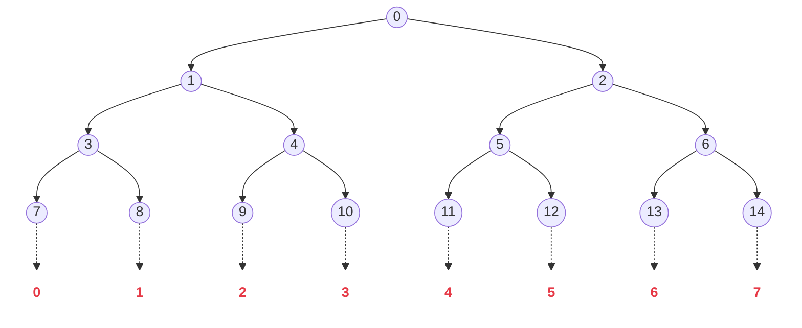

# Shorter, Tighter, FAESTer VOLEitH

## Shorter, Tighter, FAESTer: Optimizations and Improved (QROM) <br> Analysis for VOLE-in-the-Head Signatures

### authors: Carsten Baum , Ward Beullens , Lennart Braun etc.

### presenter: Tianyi Wang

### 2026-02-22

---
section: highlight
---

# 主要内容

CRYTPO2023$^{[1]}$提出VOLEitH实现基于VOLE的ZKP公开可验证，并构造了FAEST（对AES进行VOLEitH的ZKP，实现后量子签名，安全性依赖于AES的安全性）

亚密2024$^{[2]}$提出BAVC优化了数据结构，原本每个门都需要的GGM树（生成一组N-out-of-N-1 OT），该论文把全部树合成为一个大树，提升性能

本文(CRYTPO2025)$^{[3]}$对AES的进一步优化，并且目前是NIST后量子签名候选方案，具体包括：

- 把GGM树叶子节点的哈希改为AES-CTR（PRG），加快生成速度
- 设计3-degree检查策略，减少25%的通信量
- 实现了QROM下的安全性证明
- 原本$^{[1]}$的代码是rust写的， 本文$^{[3]}$改为c语言的 $^{[4]}$并提交给了NIST

<br>

> references: <br> \[1] Publicly Verifiable Zero-Knowledge and Post-Quantum Signatures from VOLE-in-the-Head (Authors: Carsten Baum, Lennart Braun, Cyprien Delpech de Saint Guilhem, et al.)  <br> \[2] One Tree to Rule Them All: Optimizing GGM Trees and OWFs for Post-Quantum Signatures (Authors: Carsten Baum, Ward Beullens, Shibam Mukherjee, et al.) <br> \[3] Shorter, Tighter, FAESTer: Optimizations and Improved (QROM) Analysis for VOLE-in-the-Head Signatures (Authors: Carsten Baum, Ward Beullens, Lennart Braun, et al.) <br> \[4] https://github.com/faest-sign/faest-ref

---

# 后量子签名方案对比

安全级别：128-bit

| 算法类别 | 具体方案 | 签名速度 | 验证速度 | 签名大小 | 安全性基础 |
| :--- | :--- | :--- | :--- | :--- | :--- |
| 基于编码 | SDitH / CROSS | 毫秒级 | 毫秒级 | $\color{red}{\text{7 kB - 9 kB}}$ | 伴随式解码难题 |
| 基于格 (Lattice) | Dilithium <br>(现 ML-DSA) | $\color{green}{\text{数十微秒级 }}$ | $\color{green}{\text{数十微秒级 }}$ | $\color{green}{\text{2.4 kB}}$ | 格困难问题 (如 LWE, SIS) |
| 早期 MPCitH | Picnic / Banquet | $\color{red}{\text{数十毫秒级 }}$ | $\color{red}{\text{数十毫秒级 }}$ | $\color{red}{\text{12 kB - 30+ kB}}$ | 纯对称密码 (哈希) |
| 哈希签名 | SPHINCS+ <br>(现 SLH-DSA) | $\color{red}{\text{数十至上百毫秒级}}$ | $\color{green}{\text{亚毫秒级 (< 1 ms)}}$ | $\color{red}{\text{7.8 kB - 17 kB}}$ | 纯对称密码 (哈希) |
| 本文方案 (VOLEitH) | Optimized FAEST | 0.46 ms - 3.88 ms | 0.34 ms - 3.04 ms | 3.9 kB - 5.9 kB | 纯对称密码<br> (AES, SHAKE) |

> references: \[CRYPTO2025] Shorter, Tighter, FAESTer: Optimizations and Improved (QROM) Analysis for VOLE-in-the-Head Signatures

---
section: Preliminaries
layout: two-cols
---

# VOLE

P持有 $u,m$ ， V持有 $\Delta,v$，满足：

$$
m = u\cdot \Delta + v
$$

对于每个witness $w$，P发送 $d=w-u$，V更新 $m'=m+d\cdot \Delta$（加法门是免费的）

对于乘法门，P计算多项式 ，V检查在$\Delta$处多项式是否符合条件

例如quicksilver：

例如JesseQ：

---

# 具体算法流程


---

# VOLEitH

Prover commit first

then calculate $\Delta$ by fait shamir

VOLE是非指定验证者的，想公开验证，先证明后用证明结果的Fait-Shamir生成$\Delta$


---
layout: two-cols
---
# GGM Tree

目标：construct N-out-of-N-1 OT（再具体一点，和别的对接）

用于打开N个数值里面的 $N-1$个数值（OT协议）

原有方案：证明者对 N 个数字进行承诺，然后公开 $N-1$ 个数字

假设 $N$ 个数字分别为 $\{a_i\}_{i\in N}$

1. 对每个数字进行哈希，然后计算一起的哈希
2. 验证者选择第 $p$ 个数字
3. 证明者公开其他 $N-1$ 个节点的信息以及 第 $p$ 个数字的哈希<br>
即  $\{a_i\}_{i\in N\land i\neq p}$ 和 $H(a_p)$
4. 验证者计算 $N-1$ 个节点的哈希，最终检查承诺

共需发送 N 个数据

利用GGM树，把通讯开销降低到 log(N)

::right::

<br><br><br><br>
若验证者选择节点 $p$，Prover只需发送根节点到 $p$ 路径上的<br>
全部**邻居**节点和 $H(a_p)$ 即可
```
           ROOT
         /      \ （父节点通过PRG逐层生成子节点）
        r1       r2
       /  \     /   \
     r3    r4  r5    r6
     ↓    ↓  ↓    ↓
   H(r3) H(r4) H(r5) H(r6)
           ↓↓↓ （可以直接把全部哈希结果拼接然后再进行一次哈希）
            com
```

假设需要隐藏的数字是 $r4$，则Prover向Verfier发送 $r2\ r3\ H(r4)$<br>
Verifier可以恢复 $com$ 的但不知道 $r4$ 的信息

---
section: BAVC[Asiacrypt 2024]
---

# 单颗GGM+叶子交错

核心用单一大树替代很多小树

旧方案：生成 $\tau$ 棵独立的树，每棵树有 $N$ 个叶子，为了隐藏每棵树的一个叶子，需要披露 $\tau\cdot\log N$ 个节点

新方案：从一个主种子出发，生成一颗有 $L=\tau\cdot N$ 个叶子的大完全二叉树

如果直接拼接（前 $N$ 个叶子给向量 $1$，第 $N+1$ 到 $2N$ 个给向量 $2$，以此类推），此时 $\tau$ 个需要被隐藏的叶子将会十分**分散**

将向量的索引**交错映射**到树的叶子上：树的第 0 个叶子对应第 1 个向量的第 0 个位置；树的第 1 个叶子对应第 2 个向量的第 0 个位置...。当隐藏的节点聚集在一起时，它们的路径会在树的较低层级（靠近叶子）就发生合并。


---

# 叶子交错

假设我们要生成 **2 个向量**（τ=2），每个向量长 **4**。总共需要 2×4=8 个叶子。 大树共有 8 个叶子，编号 0 到 7。




---
layout: two-cols
---

# 叶子交错

假设验证者要求：<br>第 1 个向量隐藏 0 号位置；第 2 个向量隐藏 0 号位置。

原始方案：不交错 -> 前 4 个给向量 1，后 4 个给向量 2。

需隐藏的叶子：<br>
向量 1 的 0 号 -> 叶子 0（节点$r_7$）；<br>
向量 2 的 0 号 -> 叶子 4（节点$r_{11}$）。

需要披露节点 $r_8,r_4,r_{12},r_6$（以及$r_7$和$r_{11}$的哈希）

```
                         r0
                     /         \
               r1                  r2            
            /      \            /      \         
           r3       r4         r5       r6       
          /  \     /   \      /  \     /   \     
        r7    r8  r9   r10  r11   r12 r13   r14   
         0    1    2    3    4    5    6    7
```

::right::

<br><br><br><br>
BAVC方案：叶子交错（Interleaving）-> 将叶子按“轮次”穿插分配<br>
叶子 0 -> 向量 1 的第 0 位；叶子 1 -> 向量 2 的第 0 位<br>
叶子 2 -> 向量 1 的第 1 位；叶子 3 -> 向量 2 的第 1 位...以此类推

需隐藏的叶子：
向量 1 的 0 号 → 叶子 0（节点$r_7$）
向量 2 的 0 号 → 叶子 1（节点$r_8$）

需要披露节点$r_4,r_2$（以及$r_7$和$r_8$的哈希），大幅减小通信开销

在实际中，挑战是随机的，不一定总是“隐藏 V1 的 0 和 V2 的 0”。可能是“V1 隐藏 0，V2 隐藏 3”。

Grinding：每次签名都会改变计数器的值，哈希生成的挑战也会变。签名者会不断尝试，直到算出来的挑战是类似“V1 隐藏 0，V2 隐藏 0”或者“V1 隐藏 2，V2 隐藏 2”这种**索引相近**的情况。

总结：“叶子交错”让不同向量中相同索引的位置，在物理大GGM树上成为“邻居”，从而只需剪掉树的小树枝，而不是把树剪得支离破碎。

> 碎碎念：宏观上，对于第 $i$ 个向量需要隐藏的位置 $a_i$ （原GGM树内的位置），$max\{a_i\}-min\{a_i\}$ 的大小决定了最终的通讯开销

---

# 阈值截断与 Grinding

阈值过高 -> 很快成功，但点过于分散（签名变长甚至退化为多GGM树）<br>
阈值过低 -> 签名极小，但需要计算多次哈希

实际实现中：
- FAEST-128s（追求极小尺寸，慢速） $T_{open}=102$，签名时间为3.2ms，签名尺寸为4594Byte
- FAEST-128f（追求速度，尺寸稍大） $T_{open}=110$，签名时间为0.43ms，签名尺寸为6052Byte

其中 $T_{open}$ 为代表 GGM 树允许披露的最大节点总数。

如果超过了 $T_{open}$，则Grinding（重新计算），然后再检测有无超过阈值

---

# BAVC的具体流程

第一阶段：承诺
1. 生成树：从一个主种子 $root$ 开始，用 PRG 生成有 $L$ 个叶子节点的完全二叉树
2. 叶子映射：如前面所描述的，$leaf_0 \rightarrow$ 向量 1 的第 0 位，$leaf_1 \rightarrow$ 向量 2 的第 0 位...
3. 计算叶子承诺 $com$（计算每个叶子的哈希然后生成最终的承诺，后续有使用PRG优化的方案）

第二阶段：剪枝
1. 标记不能发送的节点（需要隐藏的节点的父亲节点和祖宗节点）
2. 计算最小需要发送哪些节点（全部不能发送的节点的邻居节点）
3. 阈值计算：计算需要发送的节点数，如果$>T_{open}$则说明太分散，需要重新生成挑战（Grinding）；若$\leq T_{open}$ 则 输出这些内容（包括隐藏节点的哈希值一起）

第三阶段：重建
1. 验证者可以根据挑战，知道哪些部分是空白，然后利用证明者发送的节点，来重构整棵树
2. 检验所有种子的哈希是否等于全局承诺 $com$

---
section: FAESTer
layout: two-cols
---

# 用 AES-CTR PRG 替代 Hash

AES 有硬件指令集加速（AES-NI），比哈希计算还快

问题：PRG 不具备哈希函数的抗碰撞性 -> 引入 Universal Hash / Almost-Injective PRG

```
           ROOT
         /      \ （父节点通过PRG逐层生成子节点，和之前一样）
        r1       r2
       /  \     /   \
     r3    r4  r5    r6
     ↓    ↓  ↓    ↓
   H(r3) H(r4) H(r5) H(r6)
           ↓↓↓  <- 这一步原本用的是哈希，把它改为 AES-CTR PRG
            com
```
::right::

<br><br><br><br>
construct a GGM Tree needs quiet a lot **hash function**(such as SHAKE, SHA-3)

solution: alter hash function by **AES-CTR (PRG)**

旧流程：$Com=Hash(Seed,...)$

---

基础组件：

A. 基于AES计数器模式的PRG： $PRG(sd,iv,twk;m)$

输入：种子 $sd$（用作AES密钥）、初始化向量 $iv$ 、微调值 $twk$ （这个微调只是个什么鬼）

操作：使用 sd 作为密钥，对 (iv+twk) 进行加密生成伪随机比特流。

输出： $m$ 比特长的随机串

FAEST

PRG 不抗碰撞，引入 Universal Hash

输入随机数r

使用 PRG将 r 扩展为更长的串 (sd,x_1)\leftarrow PRG(r,iv,twk;4\lambda)

sd 是后续协议的种子，x_1 是额外的随机扩充

使用一个通用哈希对拓展后的结果压缩 com\leftarrow H_{uhash}(sd||x_1)

FAEST-EM

com\leftarrow PRG(r,iv,twk;2\lambda)

依赖于**Almost-Injective PRG**（几乎单射 PRG）

（但是AES真的是几乎单射的吗）

（EM模式和原版本的区别只有这一步在叶子节点少了一个通用哈希吗）

结果：

安全性：AES在固定 Key 的情况下是可逆的。但在 GGM 树中，输入 r 是作为 **Key** 使用的。对于固定输出寻找 Key 的碰撞是非常困难的

- 统计上不抗碰撞（找到两个不同的 Key 使得它们产生相同的密文输出是可能的）
- 计算上抗碰撞（尽管碰撞存在，但要找到这样两个 Key 是非常困难的，这等同于攻破 AES 的安全性）

提供进一步的安全：Universal Hash -> 统计绑定（指一旦你给出了承诺（像把信放入信封），即使你有无限的计算能力，也几乎不可能找到两个不同的原始信息对应同一个承诺。）

独立的 Tweaks（微调）：在 GGM 树中，不同层级和位置的节点需要使用不同的“域分离”参数，以防止不同位置产生相同的值。FAEST 使用的 `PRG(sd, iv, twk)` 结构，通过将 `twk`（微调值）加到 IV 上，再配合 CTR 模式的计数器，可以非常高效地为树中的每个节点生成独立的随机流，而无需频繁更换 AES 的 Key（换 Key 在硬件上通常比处理 IV 更慢）。

---
layout: two-cols
---

# 具体代码里的实现

 1. 记号约定

- 安全参数：$\lambda$
- 叶子索引：$(i,j)$
- 叶子密钥（由种子树展开得到）：$k_{i,j}$
- 公共输入：$\mathrm{iv}$
- 轮内 tweak：$\mathrm{tweak}_i$
- 行内 Universal Hash 系数：$a_i$
- 串接记号：$\|$

2. 标准模式（FAEST 非 EM）叶子承诺

2.1 单个叶子如何得到叶子承诺

给定一个叶子 $(i,j)$，步骤如下：

1. 先用 PRG 扩展得到 $4\lambda$ 比特：

$X_{i,j} = \mathrm{PRG}(k_{i,j};\mathrm{iv},\mathrm{tweak}_i) \in \{0,1\}^{4\lambda}.$

2. 将 $X_{i,j}$ 切分为两段（对应实现中的前后两部分）：

$X_{i,j} = (x^{(0)}_{i,j}, x^{(1)}_{i,j}).$

3. 计算叶子承诺（Universal Hash 压缩）：

$c_{i,j} = a_i \cdot x^{(0)}_{i,j} + x^{(1)}_{i,j}.$

这里 $c_{i,j}$ 就是该叶子的 commitment（代码里的 `com_ij`）。

4. 同时保留种子分量（代码里的 `sd_ij`）：

$sd_{i,j} = x^{(0)}_{i,j}.$

2.2 如何从叶子承诺得到最终承诺

最终承诺不是单叶子直接得到，而是两层聚合哈希：

1. 先对固定 $i$ 的所有叶子承诺做行内聚合：

$h_i = H_1\big(c_{i,0} \| c_{i,1} \| \cdots \| c_{i,N_i-1}\big).$

2. 再对所有行聚合值做一次总哈希：

$h = H_1\big(h_0 \| h_1 \| \cdots \| h_{\tau-1}\big).$

其中 $h$ 即 BAVC 层输出的最终承诺摘要。

::right::

3. EM 模式（FAEST-EM）叶子承诺

EM 模式的叶子承诺路径更短，不使用上述 Universal Hash 压缩。

 3.1 单个叶子的处理

给定叶子 $(i,j)$：

1. 直接保留叶子密钥作为种子：

$sd^{\mathrm{EM}}_{i,j} = k_{i,j}.$

2. 用 PRG 输出 $2\lambda$ 比特作为叶子承诺：

$c^{\mathrm{EM}}_{i,j} = \mathrm{PRG}_{2\lambda}(k_{i,j};\mathrm{iv},\mathrm{tweak}_i).$

即 EM 中叶子承诺可视为直接由 PRG 给出（无单叶子 Universal Hash 步骤）。

3.2 最终承诺聚合

EM 模式同样通过两层 $H_1$ 聚合得到最终承诺：

$h^{\mathrm{EM}}_i = H_1\big(c^{\mathrm{EM}}_{i,0} \| \cdots \| c^{\mathrm{EM}}_{i,N_i-1}\big),$

$h^{\mathrm{EM}} = H_1\big(h^{\mathrm{EM}}_0 \| \cdots \| h^{\mathrm{EM}}_{\tau-1}\big).$

4. 对比总结

- 标准模式：
  - 叶子承诺：PRG($4\lambda$) + Universal Hash 压缩
  - 目标：兼顾速度与统计绑定性
- EM 模式：
  - 叶子承诺：PRG($2\lambda$) 直接输出
  - 结构更简化，省去标准模式中的单叶子 Universal Hash 压缩步骤
- 两者最终都通过两层 $H_1$ 聚合得到全局承诺摘要

---
section: Shorter
---

# 压缩

AES S-box(y=x^{-1}) 验证 x\cdot y = 1（二次约束）

构造三次约束： $c\cdot a^2\cdot a^{16}=a$

odd and even

通信量 8 8 -> 4 8

---
section: Tighter
---

# QROM Proofs

Lossy Keys

证明思路从“提取私钥”转变为“区分公钥”。在归约中，将真实的公钥替换为一个没有对应私钥的“无效公钥”。攻击者如果还能伪造签名，就打破了底层证明系统的可靠性（Soundness），而不是知识可靠性（Knowledge Soundness）。这避免了在 QROM 下构造复杂的知识提取器，从而获得了更紧致的安全界

---
section: my idea
---

# 国密

AES -> SM4 

SHA-3 -> SM3

---

# AES -> SM4 

- ZKP部分（已完成）
- 把AES-CTR (PRG)替换为SM4（已完成）
- 待完成：degree-3优化<br>（SM4结构不一样，应使用1:3结构，具体而言AES是8 8 变 4 8，SM4是 8 8 8 8 变为 4 8 8 8）
- 纯软件实现，SM4比AES快<br>（应该是因为AES的S-box实现依赖于openssl，不开openssl的时候PRG用的和zkp是一套函数导致变慢，从实现原理上，SM4效率也的确比不过AES）

---

# SHA-3 -> SM3

- 可拓展性 -> SHA3为SHAKE结构，输出长度可变，但SM3固定 -> 解决方案：使用HMAC（待完成）